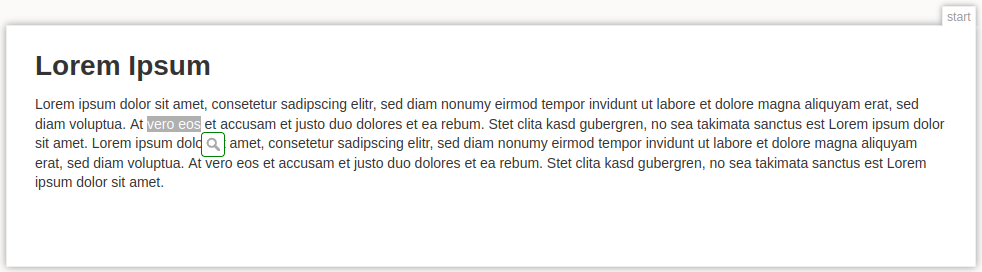
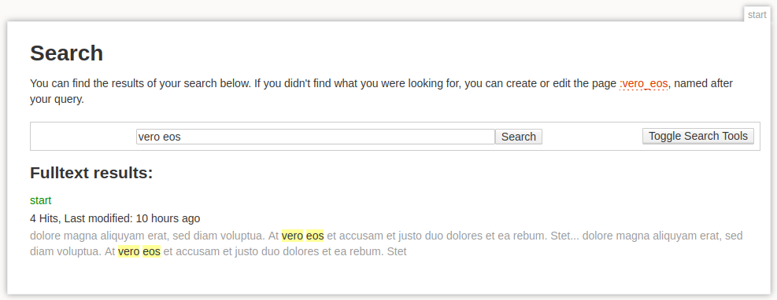

# SelectionSearch plugin

Plugin for [DokuWiki](https://github.com/dokuwiki/dokuwiki).

Pops up a tooltip when the user selects text on wiki and search result pages.
Clicking the tooltip searches the wiki for the selected text.

[Plugin Page](https://www.dokuwiki.org/plugin:selectionsearch)

## Build script

Prerequisites:
- PHP 8 for PHP static code analysis and optimization
- closure-compiler for Javascript static code analysis and optimization
- gzip for asset precompression
- zip for packaging

Run `./make.sh release` to build a release package. This minifies PHP and Javascript code.

Run `./make.sh debug` to build a debug package with better readable code.

## Installation

Install the plugin package using the Extension Manager.

## Configuration

There are three configuration options available through the Admin interface:
| Name | Default |
| --- | --- |
| Minimal length of the selection | 3 |
| Actions where the tooltip is activated | search,show |
| Open search in new tab or window | yes |

## License

[GPLv2](LICENSE), for better compatibility with DokuWiki itself.
